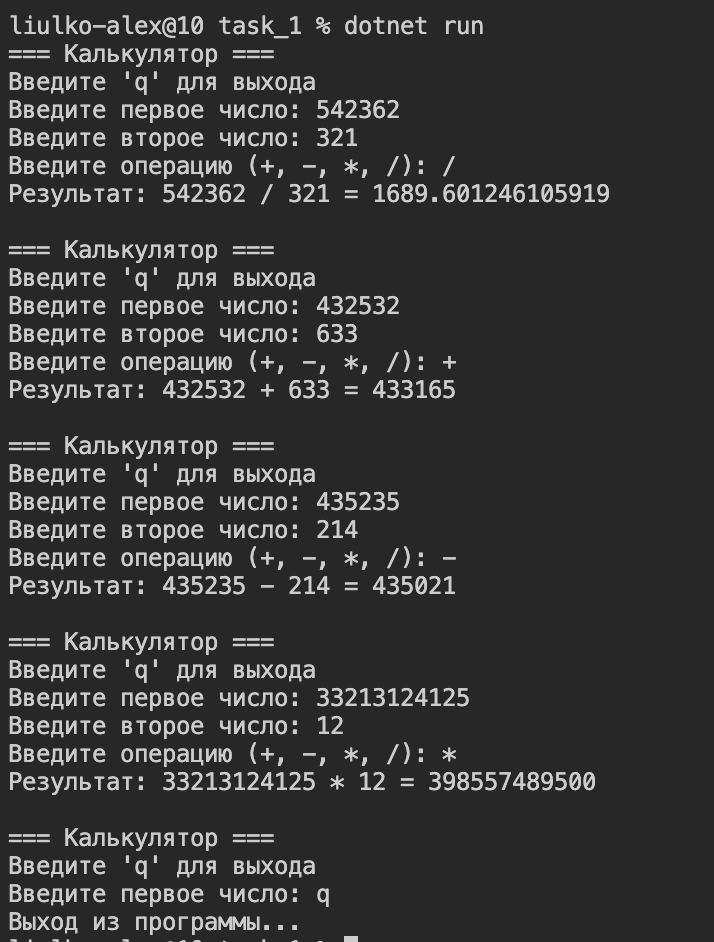

# Калькулятор на C#

Простой консольный калькулятор для выполнения базовых арифметических операций.

## Как запустить

```bash
cd hw_CSharp/task_1
dotnet run
```

## Как использовать

1. Введите первое число
2. Введите второе число
3. Введите операцию: `+`, `-`, `*` или `/`
4. Программа выведет результат
5. Для выхода введите `q`

## Пример работы


