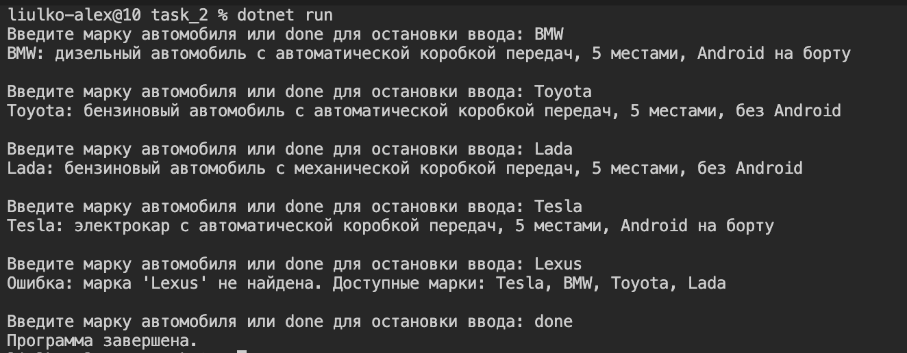

# Car Factory на C#

Простая консольная программа для демонстрации паттерна Factory и работы с интерфейсами в C#.

## Как запустить

```bash
cd task_2
dotnet run
```

## Как использовать

1. Введите марку автомобиля: Tesla, BMW, Toyota или Lada
2. Программа выведет описание автомобиля с его характеристиками
3. Для выхода введите `done`

## Пример работы


