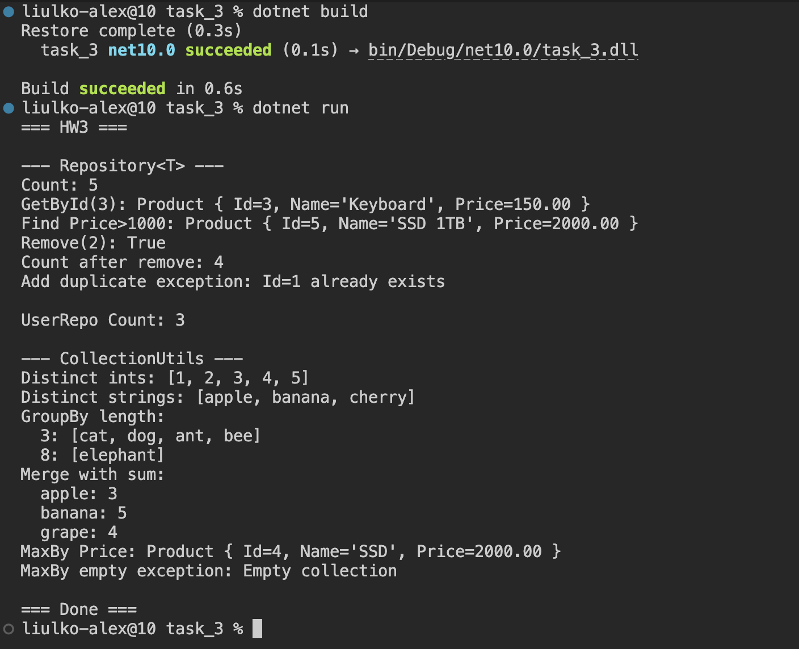

# MIPT_course HW №3

### Пример работы



### Задача 1.
Реализовать обобщённый класс-репозиторий — простое in-memory хранилище сущностей.
Требования
Создать интерфейс и класс:

```
public interface IEntity
{
    int Id { get; }
}

public class Repository<T> where T : IEntity
{
    // ...
}
```

Repository<T> должен поддерживать следующие операции:

- void Add(T item) - Добавить элемент. Если элемент с таким Id уже существует — выбросить InvalidOperationException.
- bool Remove(int id)Удалить по Id. Вернуть true, если удалили, иначе false.
- T? GetById(int id)Вернуть элемент или null, если не найден.
- IReadOnlyList<T> GetAll()Вернуть все элементы.
- int CountСвойство — количество элементов.
- IReadOnlyList<T> Find(Predicate<T> predicate) - Вернуть элементы по условию. Внутри использовать Dictionary<int, T> для O(1) доступа по Id.

Как проверить:
Создать классы Product : IEntity и User : IEntity. Показать, что один и тот же Repository<T> работает с обоими типами без дублирования кода. В Main выполнить: добавление, поиск по Id, поиск по предикату (например, продукты дороже 1000), попытку добавить дубликат и обработать исключение.

### Задача 2. Generic-методы для коллекций.
Реализовать статический класс CollectionUtils с обобщёнными методами (без LINQ - самим написать логику).
Сигнатуры:

```
public static class CollectionUtils
{
    // 1. Вернуть новый список без дубликатов, сохраняя порядок первых вхождений.
    public static List<T> Distinct<T>(List<T> source);

    // 2. Сгруппировать элементы по ключу, возвращаемому селектором.
    public static Dictionary<TKey, List<TValue>> GroupBy<TValue, TKey>(
        List<TValue> source,
        Func<TValue, TKey> keySelector) where TKey : notnull;

    // 3. Объединить два словаря. При конфликте ключей применить resolver.
    public static Dictionary<TKey, TValue> Merge<TKey, TValue>(
        Dictionary<TKey, TValue> first,
        Dictionary<TKey, TValue> second,
        Func<TValue, TValue, TValue> conflictResolver) where TKey : notnull;

    // 4. Найти элемент с максимальным значением селектора.
    // Если коллекция пуста — выбросить InvalidOperationException.
    public static T MaxBy<T, TKey>(List<T> source, Func<T, TKey> selector)
        where TKey : IComparable<TKey>;
}
```
Как проверить:
- Distinct на списке int и списке string.
- GroupBy — сгруппировать список слов по их длине: List<string> → Dictionary<int, List<string>>.
- Merge — слить два словаря Dictionary<string, int> (например, счётчики слов из двух текстов), резолвер — сумма.
- MaxBy — на списке Product найти самый дорогой товар.

